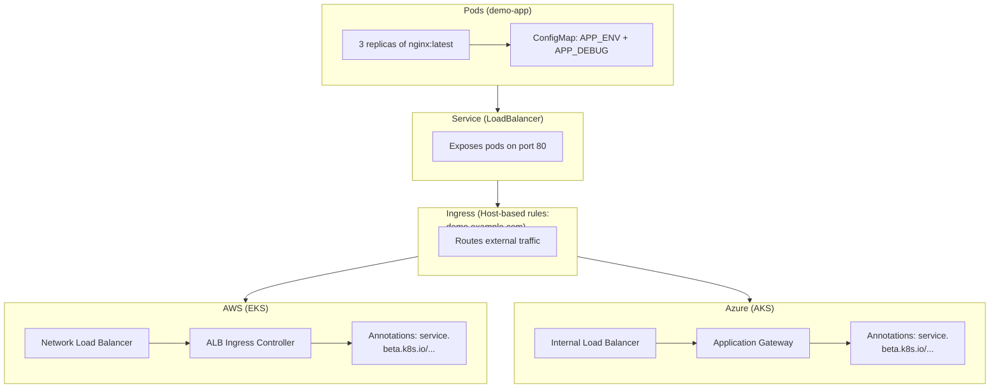
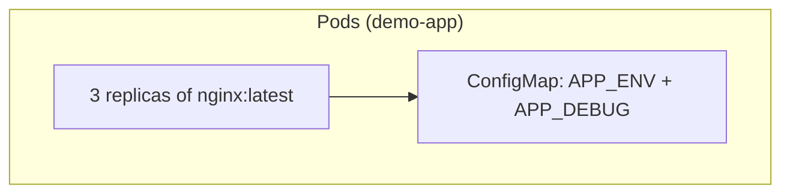
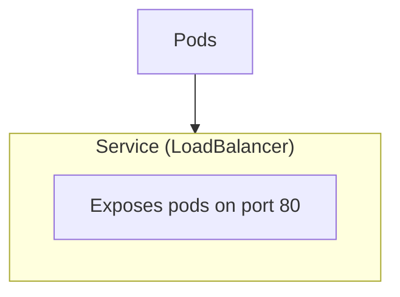
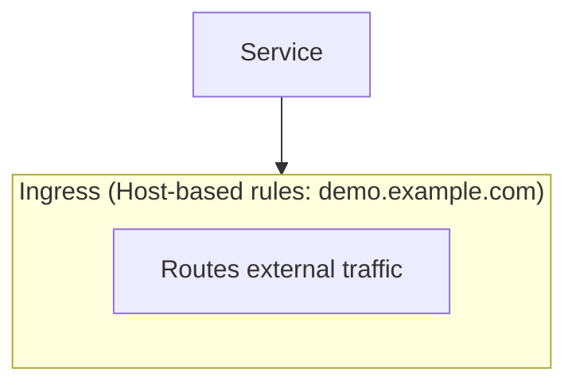
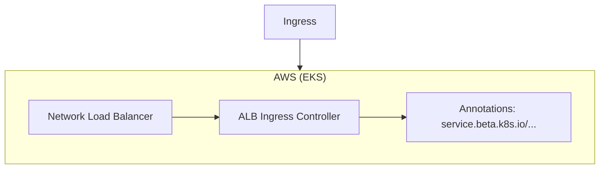
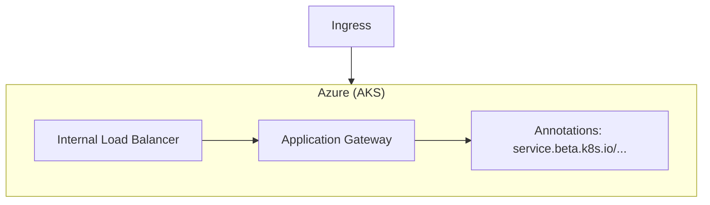
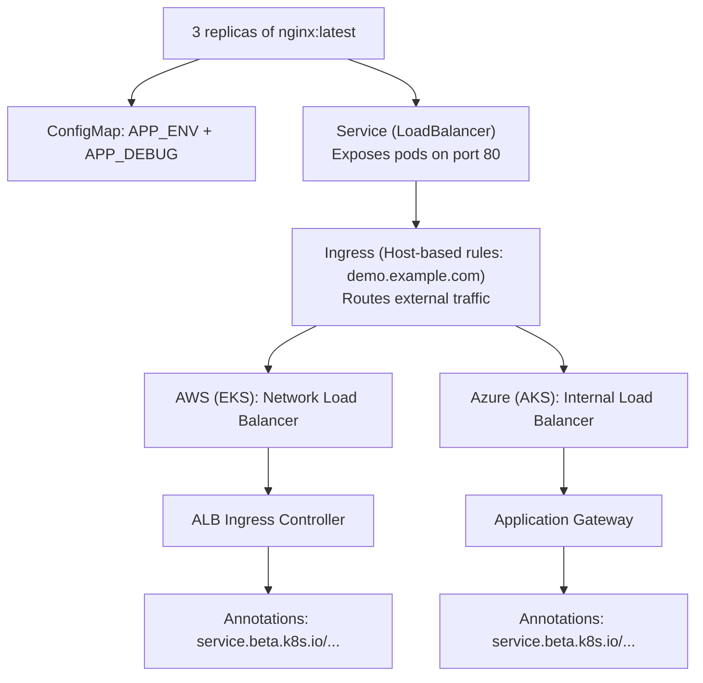
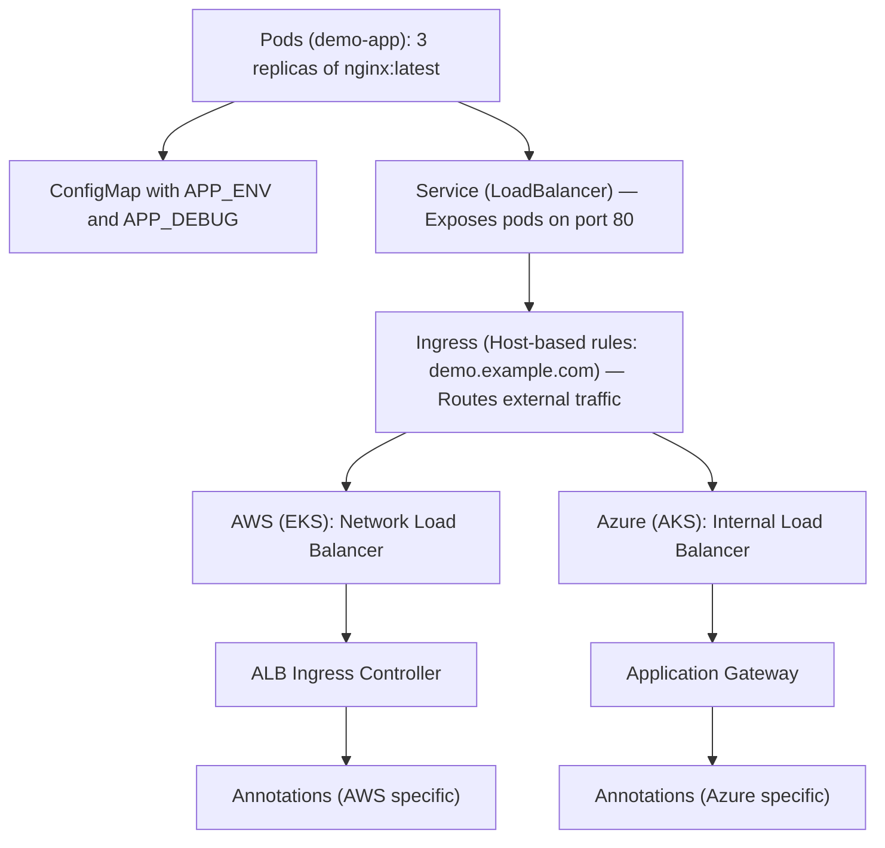
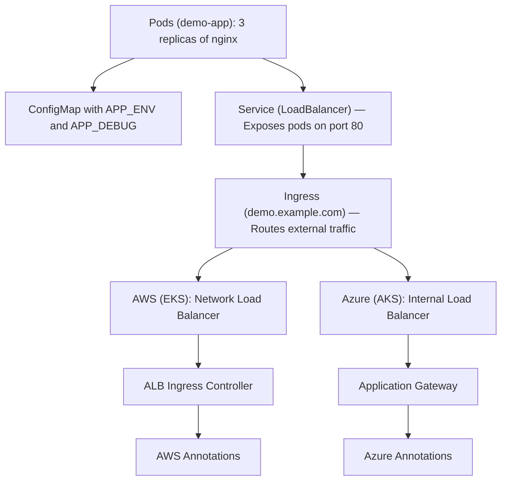
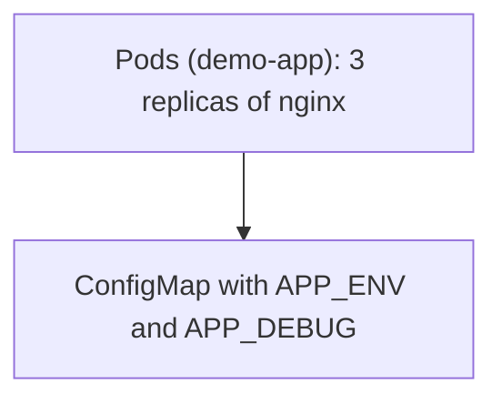

# Kubernetes Multi‑Cloud Demo

[](https://kubernetes.io/)
[](https://aws.amazon.com/eks/)
[](https://azure.microsoft.com/en-us/services/kubernetes-service/)
[](LICENSE)

A hands‑on demonstration of deploying workloads across **AWS EKS** and **Azure AKS** using Kubernetes manifests.  
This repo showcases **shared Kubernetes fundamentals** (Deployment, ConfigMap) alongside **cloud‑specific orchestration** (Service, Ingress with provider annotations).

## 📂 Repository Structure
```bash
manifests/
├── shared/                   # Portable, cloud-agnostic components
│   ├── deployment.yaml       # Generic Deployment (works everywhere)
│   └── configmap.yaml        # Generic ConfigMap (portable)
├── aws/                      # AWS EKS-specific infrastructure
│   ├── service.yaml          # Service with NLB annotation
│   └── ingress.yaml          # ALB Ingress configuration
└── azure/                    # Azure AKS-specific infrastructure
    ├── service.yaml          # Service with internal LB annotation
    └── ingress.yaml          # Application Gateway Ingress

## 🚀 Quickstart

```bash
# 1. Clone the repo
git clone https://github.com/obintui10/kubernetes-multi-cloud-demo.git
cd kubernetes-multi-cloud-demo

# 2. Apply shared manifests
kubectl apply -f manifests/shared/deployment.yaml
kubectl apply -f manifests/shared/configmap.yaml

# 3. Apply cloud‑specific manifests

# For AWS EKS:
kubectl apply -f manifests/aws/service.yaml
kubectl apply -f manifests/aws/ingress.yaml

# For Azure AKS:
kubectl apply -f manifests/azure/service.yaml
kubectl apply -f manifests/azure/ingress.yaml


## 🔄 Workflow
- Deployment → Creates 3 replicas of nginx:latest.
- ConfigMap → Injects environment variables (APP_ENV, APP_DEBUG).
- Service → Exposes pods via LoadBalancer (AWS NLB / Azure Internal LB).
- Ingress → Routes external traffic via ALB (AWS) or App Gateway (Azure).

## 🏗 Architecture Diagram

```text
+---------------------------------------------------+
|                 Pods (demo-app)                   |
|   - 3 replicas of nginx:latest                    |
|   - Uses ConfigMap for APP_ENV + APP_DEBUG        |
+---------------------------------------------------+
                          |
                          v
+---------------------------------------------------+
|                Service (LoadBalancer)             |
|   - Exposes pods on port 80                       |
|   - Type: LoadBalancer                            |
+---------------------------------------------------+
                          |
                          v
+---------------------------------------------------+
|                     Ingress                       |
|   - Routes external traffic                       |
|   - Host-based rules (demo.example.com)           |
+---------------------------------------------------+
             /                               \
            v                                 v
+---------------------------+     +-----------------------------+
|        AWS (EKS)          |     |        Azure (AKS)          |
|  - NLB (Network LB)       |     |  - Internal Load Balancer   |
|  - ALB (Ingress Controller)|     |  - Application Gateway      |
|  - Annotations:            |     |  - Annotations:             |
|    service.beta.k8s.io/... |     |    service.beta.k8s.io/...  |
+---------------------------+     +-----------------------------+


## 🛠 Tech Stack
- Kubernetes (apps/v1, networking.k8s.io/v1)
- AWS EKS (Network Load Balancer, ALB Ingress Controller)
- Azure AKS (Internal Load Balancer, Application Gateway Ingress)
- Helm/Terraform (optional extensions for infra provisioning)

## 📌 Future Work
- Add Helm charts for packaging workloads.
- Extend Terraform integration for cluster provisioning.
- Demonstrate CI/CD pipeline deploying manifests to EKS + AKS.
- Add monitoring stack (Prometheus + Grafana).
```
## 🏗 Architecture Diagram (Mermaid)

## 1. Pods + ConfigMap

## 2. Service (LoadBalancer)

## 3. Ingress Rules

## 4. AWS Ingress Path

## 5. Azure Ingress Path




1. Pods + ConfigMap

